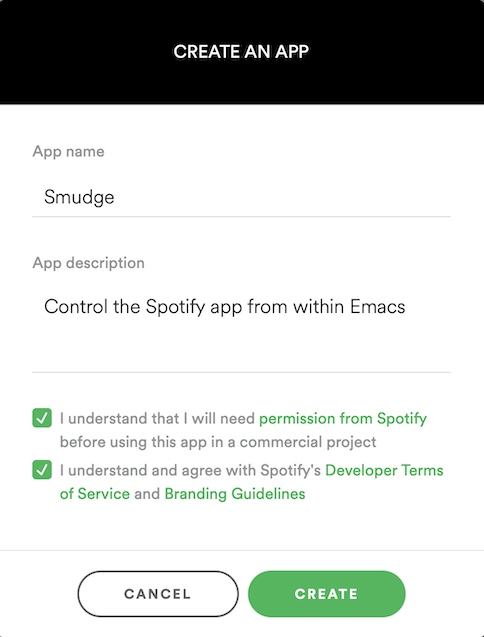

# Spotify.el

**Control Spotify app from within Emacs.**


Spotify.el is a collection of extensions that allows you to control the Spotify
application from within your favorite text editor.

**Note:** This is _very_ alpha software, and it works only in Mac OS X and Linux.

## Features

* Spotify client integration for GNU/Linux (via D-Bus) and OS X (via AppleScript)
* Communicates with the Spotify API via Oauth2
* Displays the current track in mode line
* Create playlists (public or private)
* Browse the Spotify featured playlists, your own playlists, and their tracks
* Search for tracks and playlists that match the given keywords
* Easily control basic Spotify player features like, play/pause, previous, 
  next, shuffle, and repeat with the Spotify Remote minor mode

## Installation

First, make sure your system satisfies the given dependencies:

* Emacs 24.4+
* Python 2.7+ (needed for the Oauth2 callback server)

To manually install spotify.el, just clone this project somewhere in your
disk, add that directory in the `load-path`, and require the `spotify` module:

````el
(add-to-list 'load-path "<spotify.el-dir>")
(require 'spotify)

;; Settings
(setq spotify-oauth2-client-secret "<spotify-app-client-secret>")
(setq spotify-oauth2-client-id "<spotify-app-client-id>")
````

Or if you use [el-get](https://github.com/dimitri/el-get):

````el
(add-to-list
  'el-get-sources
  '(:name spotify.el
          :type github
          :pkgname "danielfm/spotify.el"
          :description "Control the Spotify app from within Emacs"
          :url "https://github.com/danielfm/spotify.el"
          :after (progn
                  (setq spotify-oauth2-client-secret "<spotify-app-client-secret>")
                  (setq spotify-oauth2-client-id "<spotify-app-client-id>"))))
````

In order to get the the client ID and client secret, you need to create 
[a Spotify app](https://developer.spotify.com/my-applications), specifying
<http://localhost:8591/> as the redirect URI.

### Creating The Spotify App

Go to [Create an Application](https://developer.spotify.com/my-applications/#!/applications/create)
and give your application a name and a description:



At this point, the client ID and the client secret is already available, so set
those values to `spotify-oauth2-client-id` and `spotify-oauth2-client-secret`,
respectively.

Then, scroll down a little bit, type <http://localhost:8591/> as the Redirect
URI for the application, and click **Add**:


Finally, scroll to the end of the page and hit **Save**.

## Usage

### Starting A New Session

In order to connect with the Spotify API and refresh the access token,
run <kbd>M-x spotify-connect</kbd>. This will start the Oauth2 authentication
and authorization workflow.

You may be asked to type a password since the tokens are securely stored as an
encrypted file in the local filesystem. After you enter your credentials and
authorizes the app, you should see a greeting message in the echo area.

To disconnect, run <kbd>M-x spotify-disconnect</kbd>.

### Searching For Tracks

To search for tracks, run <kbd>M-x spotify-track-search</kbd> and type in your
query. The results will be displayed in a separate buffer with the following
key bindings:

| Key              | Description                                                  |
|:-----------------|:-------------------------------------------------------------|
| <kbd>l</kbd>     | Loads the next page of results (pagination)                  |
| <kbd>g</kbd>     | Clears the results and reloads the first page of results     |
| <kbd>RET</kbd>   | Plays the track under the cursor in the context of its album |

The resulting buffer loads the `spotify-remote-mode` by default.

**Tip:** In order to customize the number of items fetched per page, just change
the variable `spotify-api-search-limit`:

````el
;; Do not use values larger than 50 for better compatibility across endpoints
(setq spotify-api-search-limit 50)
````

### Playing a Spotify URI

To ask the Spotify client to play a resource by URI, run
<kbd>M-x spotify-play-uri</kbd> and enter the resource URI.

### Creating Playlists

To create new playlists, run <kbd>M-x spotify-create-playlist</kbd> and follow
the prompts.

Currently it's not possible to add tracks to a playlist you own, or to remove
tracks from them.

### Searching For Playlists

To return the playlists for the current user, run
<kbd>M-x spotify-my-playlists</kbd>, or
<kbd>M-x spotify-user-playlists</kbd> to list the public playlists for some
given user. To search playlists that match the given search criteria, run
<kbd>M-x spotify-playlist-search CRITERIA</kbd>. Also, run
<kbd>M-x spotify-featured-playlists</kbd> in order to browse the featured
playlists from Spotify en_US.

Change the following variables in order to customize the locale and region for
the featuerd playlists endpoint:

````el
;; Spanish (Mexico)
(setq spotify-api-locale "es_MX")
(setq spotify-api-country "MX")
````

All these commands will display results in a separate buffer with the following
key bindings:

| Key            | Description                                                |
|:---------------|:-----------------------------------------------------------|
| <kbd>l</kbd>   | Loads the next page of results (pagination)                |
| <kbd>g</kbd>   | Clears the results and reloads the first page of results   |
| <kbd>f</kbd>   | Follows the playlist under the cursor                      |
| <kbd>u</kbd>   | Unfollows the playlist under the cursor                    |
| <kbd>t</kbd>   | Lists the tracks of the playlist under the cursor          |
| <kbd>RET</kbd> | Plays the playlist under the cursor from the beginning (*) |

Once you opened the list of tracks of a playlist, you get the following key
bindings in the resulting buffer:

| Key              | Description                                                         |
|:-----------------|:--------------------------------------------------------------------|
| <kbd>l</kbd>     | Loads the next page of results (pagination)                         |
| <kbd>g</kbd>     | Clears the results and reloads the first page of results            |
| <kbd>f</kbd>     | Follows the current playlist                                        |
| <kbd>u</kbd>     | Unfollows the current playlist                                      |
| <kbd>RET</kbd>   | Plays the track under the cursor in the context of the playlist (*) |
| <kbd>M-RET</kbd> | Plays the track under the cursor in the context of its album        |

Both buffers load the `spotify-remote-mode` by default.

(*) No proper support for this in Spotify client for GNU/Linux

### Remote Minor Mode

Whenever you enable the `spotify-remote-mode` you get the following key
bindings:

| Key                | Function                 | Description                    |
|:-------------------|:-------------------------|:-------------------------------|
| <kbd>M-p M-s</kbd> | `spotify-toggle-shuffle` | Turn shuffle on/off (*)        |
| <kbd>M-p M-r</kbd> | `spotify-toggle-repeat`  | Turn repeat on/off (*)         |
| <kbd>M-p M-p</kbd> | `spotify-toggle-play`    | Play/pause                     |
| <kbd>M-p M-f</kbd> | `spotify-next-track`     | Next track                     |
| <kbd>M-p M-b</kbd> | `spotify-previous-track` | Previous track                 |

This is particularly useful for those using keyboards without media keys.

Also, the current song being played by the Spotify client is displayed at the
mode line along with the player status (playing, paused). The interval in which
the mode line is updated can be configured via the
`spotify-mode-line-refresh-interval` variable:

````el
;; Updates the mode line every second (set to 0 to disable this feature)
(setq spotify-mode-line-refresh-interval 1)
````

(*) No proper support for this in Spotify client for GNU/Linux

#### Customizing The Mode Line

The information displayed in the mode line can be customized by setting the
desired format in `spotify-mode-line-format`. The following placeholders are
supported:

| Symbol | Description                             | Example                        |
|:-------|:----------------------------------------|:-------------------------------|
|  `%u`  | Track URI                               | `spotify:track:<id>`           |
|  `%a`  | Artist name                             | `Pink Floyd`                   |
|  `%at` | Artist name (truncated)                 | `Pink Floyd`                   |
|  `%t`  | Track name                              | `Us and Them`                  |
|  `%tt` | Track name (truncated)                  | `Us and Them`                  |
|  `%n`  | Track #                                 | `7`                            |
|  `%d`  | Track disc #                            | `1`                            |
|  `%s`  | Player state (*)                        | `playing`, `paused`, `stopped` |
|  `%l`  | Track duration, in minutes              | `7:49`                         |
|  `%p`  | Current player position, in minutes (*) | `2:23`                         |

The default format is `"%at - %tt [%l]"`.

The number of characters to be shown in truncated fields can be configured via
the `spotify-mode-line-truncate-length` variable.

````el
(setq spotify-mode-line-truncate-length 10) ; default: 15
````

(*) No proper support for this in Spotify client for GNU/Linux

#### Global Remote Mode

This mode can be enabled globally by running
<kbd>M-x global-spotify-remote-mode</kbd>.

## Donate

If this project is useful for you, buy me a beer!

Bitcoin: `1CLFiuB5oghPjnq8zXFkYgKyFnCTVWEV1r`

## License

Copyright (C) Daniel Fernandes Martins

Distributed under the New BSD License. See COPYING for further details.
