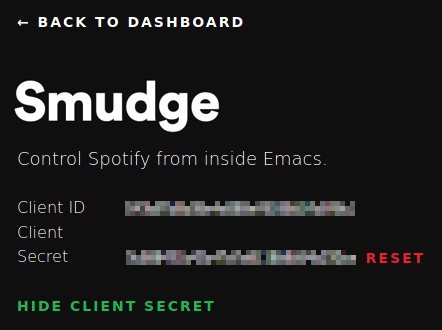

# Spotify.el

**Control Spotify app from within Emacs.**

[](https://asciinema.org/a/218654)

Spotify.el is a collection of extensions that allows you to control the Spotify application from
within your favorite text editor. If you are running on Mac OS X or Linux, you can control the
locally running instance. If you are running on any platform with a network connection (including
Windows - and even headless!) and have a Spotify premium subscription, you can control an instance
of Spotify via the Spotify Connect feature.

## Features

* Spotify client integration for GNU/Linux (via D-Bus) and OS X (via AppleScript)
* Device playback display & selection using the Spotify Connect API (requires premium)
* Communicates with the Spotify API via Oauth2
* Displays the current track in mode line or title bar
* Create playlists (public or private)
* Browse the Spotify featured playlists, your own playlists, and their tracks
* Search for tracks and playlists that match the given keywords
* Easily control basic Spotify player features like, play/pause, previous,
  next, shuffle, and repeat with the Spotify Remote minor mode

## Installation

First, make sure your system satisfies the given dependencies:

* Emacs 24.4+

To manually install spotify.el, just clone this project somewhere in your
disk, add that directory in the `load-path`, and require the `spotify` module:

````el
(add-to-list 'load-path "<spotify.el-dir>")
(require 'spotify)

;; Settings
(setq spotify-oauth2-client-secret "<spotify-app-client-secret>")
(setq spotify-oauth2-client-id "<spotify-app-client-id>")
(define-key spotify-mode-map (kbd "C-c .") 'spotify-command-map)
````

That keymap prefix is just a suggestion, following the conventions suggested for minor modes as
defined in the Emacs manual [Key Binding
Conventions](https://www.gnu.org/software/emacs/manual/html_node/elisp/Key-Binding-Conventions.html#Key-Binding-Conventions). Previous
versions of this package used "M-p"

In order to get the the client ID and client secret, you need to create
[a Spotify app](https://developer.spotify.com/my-applications), specifying
<http://localhost:8080/spotify-callback> as the redirect URI (or whichever port you have specified via customize).
The OAuth2 exchange is handled by `simple-httpd`. If you are not already using this package for something else, you should not need to customize this port. Otherwise, you'll want to set it to whatever port you are running on.

To use the "Spotify Connect" transport (vs. controlling only your local instance - though you can
also control your local instance as well), set `spotify-transport` to `'connect` as follows. This
feature requires a Spotify premium subscription.

````el
(setq spotify-transport 'connect)
````

### Creating The Spotify App

Go to [Create an Application](https://developer.spotify.com/my-applications/#!/applications/create)
and give your application a name and a description:


After creating the new app, click the **Edit Settings**, scroll down a little bit,
type <http://localhost:8080/spotify-callback> as the Redirect URI for the
application, and click **Add**. Then, hit **Save**.


At this point, the client ID and the client secret are available, so set those values to
`spotify-oauth2-client-id` and `spotify-oauth2-client-secret`, respectively.



## Usage

### Remote Minor Mode

Whenever you enable the `spotify-remote-mode` minor mode you get the following
key bindings:

| Key                  | Function                     | Description                                |
|:---------------------|:-----------------------------|:-------------------------------------------|
| <kbd>C-c . M-s</kbd> | `spotify-toggle-shuffle`     | Turn shuffle on/off [1]                    |
| <kbd>C-c . M-r</kbd> | `spotify-toggle-repeat`      | Turn repeat on/off [1]                     |
| <kbd>C-c . M-p</kbd> | `spotify-toggle-play`        | Play/pause                                 |
| <kbd>C-c . M-f</kbd> | `spotify-next-track`         | Next track                                 |
| <kbd>C-c . M-b</kbd> | `spotify-previous-track`     | Previous track                             |
| <kbd>C-c . p m</kbd> | `spotify-my-playlists`       | Show your playlists                        |
| <kbd>C-c . p f</kbd> | `spotify-featured-playlists` | Show the featured playlists                |
| <kbd>C-c . p s</kbd> | `spotify-playlist-search`    | Search for playlists                       |
| <kbd>C-c . p u</kbd> | `spotify-user-playlists`     | Show playlists for the given user          |
| <kbd>C-c . p c</kbd> | `spotify-create-playlist`    | Create a new playlist                      |
| <kbd>C-c . t r</kbd> | `spotify-recently-played`    | List of recently played tracks             |
| <kbd>C-c . t s</kbd> | `spotify-track-search`       | Search for tracks                          |
| <kbd>C-c . v u</kbd> | `spotify-volume-up`          | Increase the volume [2]                    |
| <kbd>C-c . v d</kbd> | `spotify-volume-down`        | Decrease the volume [2]                    |
| <kbd>C-c . v m</kbd> | `spotify-volume-mute-unmute` | Alternate the volume between 0 and 100 [2] |
| <kbd>C-c . d</kbd>   | `spotify-select-device`      | Select a playback device [2]               |

The current song being played by the Spotify client is displayed in the mode
line along with the player status (playing, paused). The interval in which the
player status is updated can be configured via the
`spotify-player-status-refresh-interval` variable:

````el
;; Updates the player status every 10 seconds (default is 5)
;; Note: Set 0 to disable this feature, and avoid values between 1 and 4 when
;; using the 'connect transport.
(setq spotify-player-status-refresh-interval 10)
````

[1] No proper support for this in D-Bus implementation for GNU/Linux  
[2] This feature uses Spotify Connect and requires a premium subscription

Users of the package hydra may find the code below more convenient for managing
Spotify:

````el
;; A hydra for controlling spotify.
(defhydra hydra-spotify (:hint nil)
    "
^Search^                  ^Control^               ^Manage^
^^^^^^^^-----------------------------------------------------------------
_t_: Track               _SPC_: Play/Pause        _+_: Volume up
_m_: My Playlists        _n_  : Next Track        _-_: Volume down
_f_: Featured Playlists  _p_  : Previous Track    _x_: Mute
_u_: User Playlists      _r_  : Repeat            _d_: Device
^^                       _s_  : Shuffle           _q_: Quit
"
    ("t" spotify-track-search :exit t)
    ("m" spotify-my-playlists :exit t)
    ("f" spotify-featured-playlists :exit t)
    ("u" spotify-user-playlists :exit t)
    ("SPC" spotify-toggle-play :exit nil)
    ("n" spotify-next-track :exit nil)
    ("p" spotify-previous-track :exit nil)
    ("r" spotify-toggle-repeat :exit nil)
    ("s" spotify-toggle-shuffle :exit nil)
    ("+" spotify-volume-up :exit nil)
    ("-" spotify-volume-down :exit nil)
    ("x" spotify-volume-mute-unmute :exit nil)
    ("d" spotify-select-device :exit nil)
    ("q" quit-window "quit" :color blue))

(bind-key "a" #'hydra-spotify/body some-map)
````

#### Customizing The Player Status

The information displayed in the player status can be customized by setting the
desired format in `spotify-player-status-format`. The following placeholders are
supported:

| Symbol | Description                | Example                        |
|:------:|:---------------------------|:-------------------------------|
| `%u`   | Track URI                  | `spotify:track:<id>`           |
| `%a`   | Artist name (truncated)    | `Pink Floyd`                   |
| `%t`   | Track name (truncated)     | `Us and Them`                  |
| `%n`   | Track #                    | `7`                            |
| `%l`   | Track duration, in minutes | `7:49`                         |
| `%r`   | Player repeat status       | `R`, `-`                       |
| `%s`   | Player shuffle status      | `S`, `-`                       |
| `%p`   | Player playing status      | `Playing`, `Paused`, `Stopped` |

The default format is `"[%p: %a - %t ◷ %l %r%s]"`.

The number of characters to be shown in truncated fields can be configured via
the `spotify-player-status-truncate-length` variable.

````el
(setq spotify-player-status-truncate-length 10) ; default: 15
````

The text indicator for each of the following player statuses can be configured
via their corresponding variables:

| Player State  | Variable                                   | Default Value |
|:--------------|:-------------------------------------------|:-------------:|
| Playing       | `spotify-player-status-playing-text`       | `"Playing"`   |
| Paused        | `spotify-player-status-paused-text`        | `"Paused"`    |
| Stopped       | `spotify-player-status-stopped-text`       | `"Stopped"`   |
| Shuffling On  | `spotify-player-status-repeating-text`     | `"R"`         |
| Shuffling Off | `spotify-player-status-not-repeating-text` | `"-"`         |
| Repeating On  | `spotify-player-status-shuffling-text`     | `"S"`         |
| Repeating Off | `spotify-player-status-not-shuffling-text` | `"-"`         |

#### Global Remote Mode

This mode can be enabled globally by running
<kbd>M-x global-spotify-remote-mode</kbd>.

### Searching For Tracks

To search for tracks, run <kbd>M-x spotify-track-search</kbd> and type in your
query. The results will be displayed in a separate buffer with the following
key bindings:

| Key              | Description                                                      |
|:-----------------|:-----------------------------------------------------------------|
| <kbd>a</kbd>     | Adds track to a playlist                                         |
| <kbd>l</kbd>     | Loads the next page of results (pagination)                      |
| <kbd>g</kbd>     | Clears the results and reloads the first page of results         |
| <kbd>M-RET</kbd> | Plays the track under the cursor in the context of its album [1] |

[1] D-Bus implementation for GNU/Linux do not support passing the context, so
only the track under the cursor will be played

The resulting buffer loads the `spotify-remote-mode` by default.

**Tip:** In order to customize the number of items fetched per page, just change
the variable `spotify-api-search-limit`:

````el
;; Do not use values larger than 50 for better compatibility across endpoints
(setq spotify-api-search-limit 50)
````

### Playing a Spotify URI

To ask the Spotify client to play a resource by URI, run
<kbd>M-x spotify-play-uri</kbd> and enter the resource URI.

### Creating Playlists

To create new playlists, run <kbd>M-x spotify-create-playlist</kbd> and follow
the prompts.

Currently it's not possible to add tracks to a playlist you own, or to remove
tracks from them.

### Searching For Playlists

To return the playlists for the current user, run
<kbd>M-x spotify-my-playlists</kbd>, or
<kbd>M-x spotify-user-playlists</kbd> to list the public playlists for some
given user. To search playlists that match the given search criteria, run
<kbd>M-x spotify-playlist-search CRITERIA</kbd>. Also, run
<kbd>M-x spotify-featured-playlists</kbd> in order to browse the featured
playlists from Spotify en_US.

Change the following variables in order to customize the locale and region for
the featured playlists endpoint:

````el
;; Spanish (Mexico)
(setq spotify-api-locale "es_MX")
(setq spotify-api-country "MX")
````

All these commands will display results in a separate buffer with the following
key bindings:

| Key              | Description                                              |
|:-----------------|:---------------------------------------------------------|
| <kbd>l</kbd>     | Loads the next page of results (pagination)              |
| <kbd>g</kbd>     | Clears the results and reloads the first page of results |
| <kbd>f</kbd>     | Follows the playlist under the cursor                    |
| <kbd>u</kbd>     | Unfollows the playlist under the cursor                  |
| <kbd>t</kbd>     | Lists the tracks of the playlist under the cursor        |
| <kbd>M-RET</kbd> | Plays the playlist under the cursor                      |

Once you open the list of tracks of a playlist, you get the following key
bindings in the resulting buffer:

| Key              | Description                                                         |
|:-----------------|:--------------------------------------------------------------------|
| <kbd>a</kbd>     | Adds track to a playlist                                            |
| <kbd>l</kbd>     | Loads the next page of results (pagination)                         |
| <kbd>g</kbd>     | Clears the results and reloads the first page of results            |
| <kbd>f</kbd>     | Follows the current playlist                                        |
| <kbd>u</kbd>     | Unfollows the current playlist                                      |
| <kbd>M-RET</kbd> | Plays the track under the cursor in the context of the playlist [1] |

Both buffers load the `spotify-remote-mode` by default.

[1] D-Bus implementation for GNU/Linux do not support passing the context, so
only the track under the cursor will be played

## Selecting a Device for Playback

<kbd>M-x spotify-select-device</kbd> will display a list of devices available for playback in a separate buffer.

Note: use of this feature requires a Spotify premium subscription.

Once you open the list of devices, you get the following key bindings in the resulting buffer:

| Key              | Description                                                         |
|:-----------------|:--------------------------------------------------------------------|
| <kbd>RET</kbd>   | Transfer playback to the device under the cursor.                   |
| <kbd>g</kbd>     | Reloads the list of devices                                         |

## Specifying the Player Status Location

By default, the player status (playing, paused, track name, time, shuffle, repeat, etc.) are shown
in the modeline. If you want to display the status in the title bar when using a graphical display,
you can set the following:

````el
(setq spotify-status-location 'title-bar)

````

Valid values include `'title-bar`, `'modeline` and `nil`, where nil turns off the display of the
player status completely. If the value is set to `title-bar` but you are not using a graphical
display, the player status will be displayed in the mode line instead.

If you want to customize the separator between the existing title bar text and the player status,
you can set the following, i.e.:
````el
(setq spotify-title-bar-separator "----")
````
Otherwise, it defaults to 4 spaces.

## License

Copyright (C) Daniel Fernandes Martins

Distributed under the GPL v3 License. See COPYING for further details.
